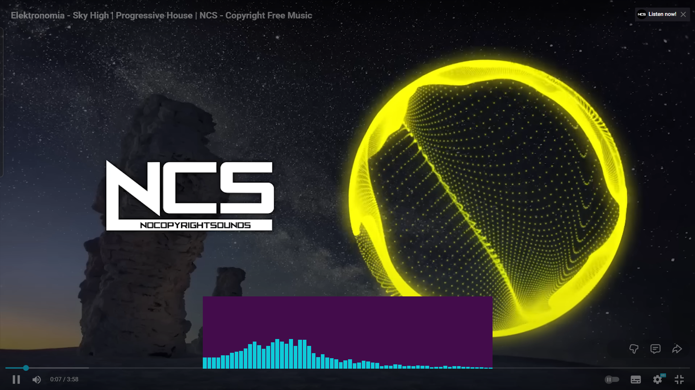

# Sound Visualiser

Made my first project in c++.

## Overview

Inspired by the NCS style circular music Visualiser, I have tried making a simpler version of the same. This is the desktop native audio visualisation utility designed for Windows.
The visualiser utilizes WASAPI Loopback feature to intercept and visualize global system audio in real-time.

Integrated and works flawlessly with the Realtime audio input (Sytem audio, not the microphone). Tested with Youtube, spotify and games, the Soundwave renders a responsive frequency based visualisation overlay.



### Core Functionality

- **System-Wide Audio Capture:** Utilizes low-latency WASAPI loopback to capture audio from any running application without requiring virtual audio cables.
- **Real-Time FFT Analysis:** Implements Fast Fourier Transform algorithms to convert time-domain audio signals into frequency-domain data for accurate spectrum visualization.
- **High-Performance Rendering:** Built on SFML 3.0 for hardware-accelerated 2D graphics, ensuring 60 FPS performance with minimal CPU overhead.

### System Data Flow

```text
[Windows OS Audio Mixer]
       |
       v
[MiniAudio Backend (WASAPI Loopback)] --> Capture Thread
       |
       v
[Raw PCM Data Buffer]
       |
       v
[KissFFT Processor] --> Converts Time Domain to Frequency Domain
       |
       v
[Normalization & Smoothing Engine] --> Applies Linear Interpolation (Lerp)
       |
       v
[SFML Render Engine] --> Draws Geometry to Window
```

### Installation and Running

1.  **Clone the Repository**

    ```powershell
    git clone https://github.com/Adityarya11/Sound-Wave-Visualizer.git
    cd Sound-Wave-Visualizer
    ```

2.  **Create Build Directory**

    ```powershell
    mkdir build
    cd build
    ```

3.  **Configure Project**
    Run CMake to generate the Visual Studio solution files. Ensure you target the x64 architecture.

    ```powershell
    cmake ..
    ```

4.  **Compile**
    Build the project in Debug or Release mode.

    ```powershell
    cmake --build . --config Release
    ```

5.  **Run**
    Navigate to the Release folder and execute the binary.

    ```powershell
    ./Release/SoundWaveVisualizer.exe
    ```

## WIP

Since the core idea was to implement a circular visualiser that thing is under development.
I have taken reference and was motivated by the video of

> [Tsoding (UI in C++)](https://www.youtube.com/watch?v=SRgLA8X5N_4)

I wont be releasing this as an app any soon but definitely try to atleast make the circular visualiser.

---

If You find this fun and cool then Thanks !!

You can watch the video as well.

<!--  -->

[Watch the video](https://github.com/user-attachments/assets/9400ee43-8f33-4258-ab64-2da620de4e90)

### Issues or work needed:

1. I know the color scheme is boring but i dont know what color to pick
2. most of the bars(sound waves) are left sided, need to make them middle.
